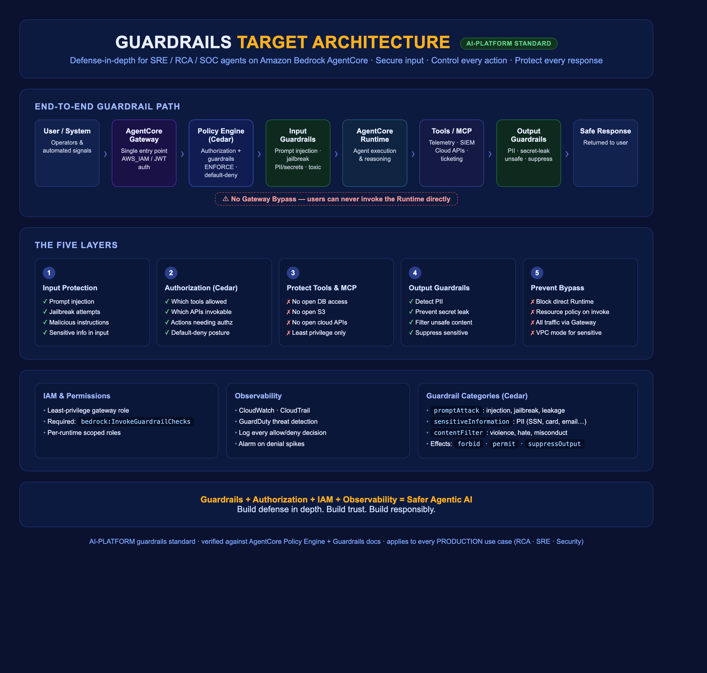
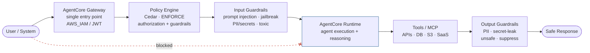

# Guardrails — Defense-in-Depth for the Agentic Platform

> **Component:** Guardrails (first AI-PLATFORM build component)
> **Objective:** secure the *entire* agent execution path — input, authorization, tools,
> output, and bypass prevention — for SRE/RCA/SOC agents, following AgentCore best practices.
> **Verified against:** AgentCore Policy Engine + Guardrails docs (see `reference/`).
> **Principle:** *Guardrails + Authorization + IAM + Observability = Safer Agentic AI.*

Building an agent is half the job. In production you must control **what the agent can
receive, what it can access, and what it can return.** This document is the platform
standard every PRODUCTION use case (RCA, SRE, Security) must implement.

---

## 1. Target architecture (end-to-end)

**Presentation assets** (rendered PNGs in `reference/`):
- `reference/guardrails-target-architecture.png` — full infographic-style overview (5 layers + IAM/observability)
- `reference/guardrails-flow.png` — the end-to-end pipeline flow with bypass-prevention

**No gateway bypass:** users/systems must never invoke the Runtime directly. All traffic
flows Gateway → Policy Engine → Guardrails → Runtime.

### How this maps to real AgentCore constructs

| Layer | AgentCore construct | Verified fact |
|---|---|---|
| Single entry | **Gateway** (`AWS_IAM` or JWT authorizer) | Gateway is the front door for all agent tool calls |
| Authorization + Guardrails | **Policy Engine** (Cedar policies), associated with the gateway | Intercepts all requests; **ENFORCE mode = default-deny**; `forbid`-overrides-`permit` |
| Input/Output filtering | Guardrail **policies** (categories: `contentFilter`, `promptAttack`, `sensitiveInformation`) | Effects: `forbid` (block input), `permit` (allow below threshold), `suppressOutput` (block response) |
| Tool least-privilege | Per-tool **Cedar permit policies** + least-privilege IAM on gateway role | Only explicitly permitted tool actions succeed |
| Bypass prevention | Gateway auth + runtime resource policy | Runtime not directly invokable by end users |

> Key correction vs. many blog diagrams: in AgentCore the "Policy Engine" and "Guardrails"
> are the **same Cedar-based mechanism** — guardrails are Cedar policies with content
> categories. Authorization (which tool/action) and content filtering (safe input/output)
> are both expressed as policies in the policy engine attached to the gateway.

---

## 2. The five layers (platform standard)

### Layer 1 — Input Protection
Block bad input before the agent reasons on it.
- **Detect prompt injection / jailbreak / prompt leakage** — Cedar guardrail policy,
  category `promptAttack` (`PROMPT_INJECTION`, `JAILBREAK`, `PROMPT_LEAKAGE`), effect
  `forbid`.
- **Detect sensitive info in input** — category `sensitiveInformation` (PII).
- **Block malicious instructions** — `contentFilter` (`VIOLENCE`, `HATE`, `MISCONDUCT`, …).
- SRE/SOC note: security agents ingest attacker-controlled text (logs, alerts) — input
  guardrails are **mandatory**, not optional.

### Layer 2 — Authorization with Cedar
Decide *what the agent is allowed to do*.
- Per-tool `permit` policies scoped to `AgentCore::Action::"<Target>___<tool>"`.
- Conditions on tool parameters (`context.input.*`) and identity (`principal.getTag(...)`).
- **Default deny**: in ENFORCE mode, anything not explicitly permitted is denied.
- Encode business rules: read telemetry = ALLOW; create ticket = ALLOW; delete resource /
  run destructive remediation = DENY (or require elevated principal).

### Layer 3 — Protect Tools & MCP (least privilege)
Never give an agent unrestricted access to databases, APIs, S3, financial/customer data.
- Each specialist gets only the tools its use case needs (RCA reads telemetry; it does not
  get write access to prod).
- Enforced at **two levels**: Cedar permit policies (per action) **and** least-privilege
  IAM on the gateway execution role (POC gap: it had `AdministratorAccess`).

### Layer 4 — Output Guardrails
Before returning a response.
- **PII detection / secret-leak prevention** — `sensitiveInformation` category with
  `suppressOutput` effect on `context.output.text`.
- **Filter unsafe content / suppress sensitive responses** — `contentFilter` +
  `suppressOutput`.
- SRE/SOC note: findings and logs frequently contain secrets/PII — output filtering
  protects against leaking them into tickets, chats, or dashboards.

### Layer 5 — Prevent Gateway Bypass
- Users/systems authenticate to the **Gateway** (AWS_IAM/JWT); they cannot call the Runtime.
- Restrict `bedrock-agentcore:InvokeAgentRuntime` on runtimes to the supervisor/gateway
  principals via resource policy — not open to end users.
- Consider **VPC network mode** for runtimes handling private telemetry.

---

## 3. Cross-cutting: IAM & Observability

**IAM & permissions**
- **Least-privilege** gateway execution role. Required permission for guardrail checks:
  `bedrock:InvokeGuardrailChecks` (plus the gateway/policy permissions).
- Per-runtime roles scoped to their tools + memory only.

**Observability (audit every interaction)**
- CloudWatch (metrics/logs), CloudTrail (audit), GuardDuty (threat detection); optional
  APM (Dynatrace/App Signals).
- Log every policy decision (allow/deny) and guardrail block for audit + tuning.
- Alarm on spikes in denials/blocks (possible attack or misconfiguration).

---

## 4. Enforcement & validation modes (know before you deploy)

- **Policy engine mode:** `ENFORCE` (deny-by-default, blocks) vs. observe/log-only —
  start in log/monitor to baseline, then switch to ENFORCE.
- **Policy enforcement mode:** `ACTIVE` (enforced) vs. draft/monitor.
- **Validation mode:** `FAIL_ON_ANY_FINDINGS` (safe default) vs. `IGNORE_ALL_FINDINGS`.
- ⚠ In ENFORCE mode you **must** add a permissive policy so benign requests pass, e.g.
  `permit (principal, action, resource is AgentCore::Gateway);` scoped appropriately —
  otherwise everything is denied.

---

## 5. Applying this to our platform (POC → target)

| Guardrail control | POC current state | Target |
|---|---|---|
| Bedrock/Cedar Guardrails | ❌ none configured | Input + output guardrail policies on every gateway |
| Policy Engine (Cedar authz) | ❌ not deployed | Policy engine per gateway, ENFORCE mode, per-tool permits |
| Tool least-privilege | ◐ gateway auth present | Per-tool Cedar permits + scoped IAM |
| Gateway execution role | ❌ `AdministratorAccess` | Least privilege + `bedrock:InvokeGuardrailChecks` |
| Bypass prevention | ◐ IAM/JWT on gateway | + runtime resource policy restricting InvokeAgentRuntime |
| Observability of decisions | ◐ CloudWatch/CloudTrail present | + policy-decision logging, denial alarms, GuardDuty |

See `examples/` for ready-to-adapt Cedar policies and the gateway/guardrail config, and
`GAP-CHECKLIST.md` for the step-by-step remediation sequence.

## 6. Definition of Done (per PRODUCTION use case)
- [ ] Gateway is the only entry; runtime not directly invokable
- [ ] Policy engine associated, ENFORCE mode, default-deny + explicit permits
- [ ] Input guardrails: promptAttack + sensitiveInformation (+ contentFilter for SOC)
- [ ] Output guardrails: sensitiveInformation + contentFilter with `suppressOutput`
- [ ] Per-tool least privilege (Cedar + IAM); gateway role least-privilege
- [ ] `bedrock:InvokeGuardrailChecks` granted; secrets via token vault
- [ ] Policy decisions logged; denial alarms; reviewed in observability

---

_Verified against AgentCore Policy Engine + Guardrails documentation. Cedar semantics
(default-deny, forbid-overrides-permit) and guardrail categories/effects are from the
official docs; see `reference/REFERENCE.md` for the source infographic transcription._
