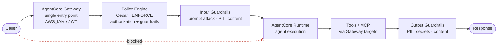

# Guardrails & Policy — AgentCore Component Standard

> **Component:** Guardrails / Policy Engine
> **Scope:** independent, use-case-agnostic best-practice reference for controlling what an
> agent can receive, access, and return on Amazon Bedrock AgentCore.
> **Structure:** the component is described once, then evaluated through the **6
> Well-Architected pillars**.
> **Sources:** cited inline; verify against the AgentCore documentation before implementing.

Guardrails control the full agent execution path: **input** (what reaches the model),
**authorization** (what the agent may do), **tool access** (least privilege), **output**
(what is returned), and **bypass prevention** (traffic can't skip the controls). In
AgentCore these are expressed through the **Policy Engine** (Cedar policies) associated
with a **Gateway**, plus guardrail content policies.

---

## 1. Component overview

### Core mechanics (verified facts)

| Concept | Fact | Source |
|---|---|---|
| Policy Engine | A collection of Cedar policies associated with a gateway; intercepts all requests and allows/denies each action | [Create a policy engine](https://docs.aws.amazon.com/bedrock-agentcore/latest/devguide/policy-create-engine.html) |
| Default deny | In ENFORCE mode, all actions are denied unless an explicit `permit` matches | [Understanding Cedar policies](https://docs.aws.amazon.com/bedrock-agentcore/latest/devguide/policy-understanding-cedar.html) |
| Evaluation | `forbid`-overrides-`permit`; each policy evaluated independently | [Understanding Cedar policies](https://docs.aws.amazon.com/bedrock-agentcore/latest/devguide/policy-understanding-cedar.html) |
| Guardrails | Content-filtering Cedar policies with categories `contentFilter`, `promptAttack`, `sensitiveInformation`; effects `forbid` / `permit` / `suppressOutput` | [Getting started with guardrails](https://docs.aws.amazon.com/bedrock-agentcore/latest/devguide/policy-guardrails-getting-started.html) |
| Guardrail checks IAM | Gateway execution role needs `bedrock:InvokeGuardrailChecks` | AgentCore guardrails guidance |

> Note: in AgentCore the "policy engine" and "guardrails" are the **same Cedar-based
> mechanism** — guardrails are Cedar policies with content categories. Authorization
> (which tool/action) and content filtering (safe input/output) are both policies on the
> policy engine attached to the gateway.

### The five control points
1. **Input protection** — prompt injection, jailbreak, prompt leakage, sensitive-info, unsafe content (`promptAttack`, `sensitiveInformation`, `contentFilter`; effect `forbid`).
2. **Authorization** — per-tool/per-action `permit` policies; default-deny.
3. **Tool/MCP least privilege** — an agent gets only the tool actions it needs (Cedar + IAM).
4. **Output guardrails** — PII/secret/unsafe-content detection with `suppressOutput`.
5. **Bypass prevention** — callers reach the Gateway only; the Runtime is not directly invokable.

---

## 2. Guardrails through the 6 Well-Architected pillars

### 🔒 Security
- Enforce **default-deny**; write explicit `permit` policies only for required actions.
- Apply input + output guardrails on every model interaction (`promptAttack`,
  `sensitiveInformation`, `contentFilter`).
- **Least-privilege** gateway execution role; grant `bedrock:InvokeGuardrailChecks` and
  only the specific tool/target permissions needed — never broad admin.
- Prevent gateway bypass: restrict direct `InvokeAgentRuntime` via resource policy; keep
  the Gateway the sole entry point. Consider VPC network mode for sensitive data paths.

### 🛡️ Reliability
- Policy evaluation is deterministic (`forbid`-overrides-`permit`, default-deny) — behavior
  is predictable under all inputs.
- In ENFORCE mode, include a scoped **permissive baseline** policy so legitimate traffic
  isn't accidentally denied; validate before enforcing.
- Roll out in **monitor/log mode first**, baseline real traffic, then switch to ENFORCE.

### ⚙️ Operational Excellence
- Version all policies as code; deploy via IaC, not console.
- Use enforcement/validation modes deliberately (`ACTIVE` vs draft; validation on-findings).
- Log every allow/deny decision and guardrail block; review regularly and tune thresholds.

### 🚀 Performance Efficiency
- Guardrail checks add latency — scope policies precisely and avoid redundant categories.
- Set confidence thresholds to balance protection vs. false positives.
- Keep the policy set minimal and well-scoped so evaluation stays fast.

### 💰 Cost Optimization
- Guardrail checks and content filtering incur cost per invocation — apply where risk
  warrants, not indiscriminately.
- Right-size which categories run on which paths (e.g. output PII filtering where output
  can contain PII).

### 🌱 Sustainability
- Minimal, precise policy sets reduce evaluation overhead and wasted compute.
- Block bad input early (input guardrails) to avoid spending model/tool cycles on requests
  that will be rejected.

---

## 3. Guardrail categories & effects (reference)

| Category | Filters | Purpose |
|---|---|---|
| `contentFilter` | VIOLENCE, HATE, SEXUAL, MISCONDUCT, INSULTS | Content safety |
| `promptAttack` | JAILBREAK, PROMPT_INJECTION, PROMPT_LEAKAGE | Prompt security |
| `sensitiveInformation` | ADDRESS, EMAIL, PHONE, CREDIT_DEBIT_CARD_NUMBER, and [more](https://docs.aws.amazon.com/bedrock/latest/userguide/guardrails-sensitive-filters.html) | PII detection |

| Effect | Behavior |
|---|---|
| `permit` | Allow requests below the threshold |
| `forbid` | Block requests exceeding the threshold (input phase) |
| `suppressOutput` | Block the model's response when it exceeds the threshold (output phase) |

_Source: [Getting started with guardrails](https://docs.aws.amazon.com/bedrock-agentcore/latest/devguide/policy-guardrails-getting-started.html)._

---

## 4. Design checklist (component acceptance)
- [ ] Gateway is the single entry point; Runtime not directly invokable
- [ ] Policy engine associated; ENFORCE mode with default-deny + explicit permits
- [ ] Input guardrails: `promptAttack` + `sensitiveInformation` (+ `contentFilter` as needed)
- [ ] Output guardrails: `sensitiveInformation` + `contentFilter` with `suppressOutput`
- [ ] Per-tool least privilege (Cedar policies + scoped IAM)
- [ ] Gateway role least-privilege; `bedrock:InvokeGuardrailChecks` granted
- [ ] Policy decisions logged; alarms on denial/block spikes
- [ ] Rolled out monitor → ENFORCE with a permissive baseline

## 5. Artifacts
- `examples/cedar-policies.md` — generic Cedar policy patterns (input/output/authz).
- `examples/gateway-guardrail-setup.md` — end-to-end gateway + policy engine + guardrail wiring.
- `reference/REFERENCE.md` — background reference material.

---

## Sources
- [Create a policy engine](https://docs.aws.amazon.com/bedrock-agentcore/latest/devguide/policy-create-engine.html)
- [Understanding Cedar policies](https://docs.aws.amazon.com/bedrock-agentcore/latest/devguide/policy-understanding-cedar.html)
- [Getting started with guardrails](https://docs.aws.amazon.com/bedrock-agentcore/latest/devguide/policy-guardrails-getting-started.html)
- [Guardrails sensitive-information filters](https://docs.aws.amazon.com/bedrock/latest/userguide/guardrails-sensitive-filters.html)
- [AWS Well-Architected Framework](https://docs.aws.amazon.com/wellarchitected/latest/framework/welcome.html)

_Independent AgentCore component standard. Verify all commands, policy shapes, and IAM
against current AWS documentation before applying. Content was rephrased from AWS
documentation for compliance._
