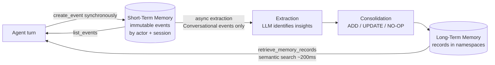
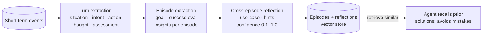

# Memory — AgentCore Component Standard

> **Component:** Memory
> **Scope:** independent, use-case-agnostic best-practice reference for agent memory on
> Amazon Bedrock AgentCore.
> **Structure:** the component is described once, then evaluated through the **6
> Well-Architected pillars**.
> **Sources:** three AWS blogs + AgentCore docs, cited inline and in `reference/SOURCES.md`.
> Verify against current documentation before implementing.

LLMs are stateless — they don't retain information between interactions. AgentCore Memory
is a fully managed service that gives agents **short-term working memory** (immediate
session context) and **long-term intelligent memory** (persistent insights across
sessions), so agents stay context-aware and improve over time without teams building
custom memory infrastructure. [1]

---

## 1. Component overview

### Design principles of the service [1]
Abstracted storage · encryption at rest and in transit · chronological continuity within
sessions · hierarchical namespaces for organization + access control · scalable,
low-latency retrieval.

### Core components [1]

| Component | What it is |
|---|---|
| **Memory resource** | Logical container for raw events + processed long-term memories. Defines retention (`eventExpiryDuration`, up to 365 days) and encryption (AWS-managed key by default, or customer-managed KMS). |
| **Short-term memory (STM)** | Raw interaction data stored **synchronously** as immutable events, organized by `actorId` + `sessionId`. Event types: **Conversational** (USER/ASSISTANT/TOOL) and **blob** (binary, e.g. checkpoints). Only Conversational events feed long-term extraction. |
| **Long-term memory (LTM)** | Extracted insights/preferences/knowledge derived from events **asynchronously** via memory strategies; persists across sessions. |
| **Namespaces** | File-system-like hierarchical paths that group/isolate memories; support access control and multi-tenant isolation. |
| **Memory strategies** | The intelligence layer defining what is extracted, how it's processed, and where it's stored. |

Three identifiers create an event: `memoryId`, `actorId`, `sessionId`. [1]

### Built-in strategies [1][2]

| Strategy | Extracts | Answers |
|---|---|---|
| **Semantic** | Facts and knowledge | "What do I know?" |
| **Summarization** | Running session summary (main points, decisions) | "What happened?" |
| **User Preference** | Explicit/implicit preferences, choices, styles | "Who is this user?" |
| **Episodic** (+ reflection) | Goal → reasoning → action → outcome, then cross-episode reflections | "How did I solve this before?" |

All built-in strategies ignore PII in long-term records by default. [1] Strategies run
**independently and in parallel**. [2]

### Customization [2]
- **Built-in with overrides** — custom prompts + custom model selection for extraction /
  consolidation (balance accuracy vs. latency).
- **Self-managed strategies** — full control of extraction/consolidation logic; ingest
  records directly via Batch APIs while AgentCore handles storage + retrieval.

---

## 2. How long-term memory works (pipeline) [2]

### Extraction — conversation → insights
When events land in STM, an **asynchronous** LLM-driven process analyzes conversational
content against prior context and produces structured memory records per configured
strategy. Meaningful utterances are kept ("I'm vegetarian"); routine chatter is not
("hmm, let me think"). Multiple memories may come from one event.

### Consolidation — merge, don't just append
Each newly extracted memory is compared against the most semantically similar existing
memories in the same namespace + strategy; an LLM decides:
- **ADD** — new information is distinct
- **UPDATE** — new knowledge complements/updates existing
- **NO-OP** — redundant

Conflicts resolve by **recency** while retaining history: outdated records are marked
**INVALID** (immutable audit trail), not deleted. Handles out-of-order events (timestamp
tracking) and consolidation failures (retry with backoff; on ultimate failure the memory
is still added to avoid data loss). [2]

### Episodic pipeline (learning from experience) [3]

- **Turn extraction** — structure each exchange (situation, intent, action, thought,
  assessment, goal assessment).
- **Episode extraction** — on goal completion, synthesize related turns into an episode
  (situation, intent, success evaluation, justification, insights).
- **Cross-episode reflection** — retrieve similar past successful episodes by intent and
  distill generalizable guidance (use case, actionable hints, confidence score). [3]

Episodic complements the other three: summarization manages context length, semantic
stores facts, preference personalizes, and episodic captures experience. [3]

### Advanced features [1]
- **Branching** — alternative conversation paths from a `rootEventId` (message edits,
  what-if scenarios) within the same resource.
- **Checkpointing** — save/mark states (blob events under separate isolation) for
  multi-session tasks and workflow resumption; checkpoint events are excluded from LTM
  extraction.

### Performance characteristics [2]
- Extraction + consolidation: ~20–40s after triggering (asynchronous).
- Semantic retrieval (`retrieve_memory_records`): ~200 ms.
- Parallel strategy processing (no blocking between strategies).
- Benchmarks show high **compression rates (≈89–95%)** vs. full-history RAG, trading a
  little factual correctness for bounded context and scalable cost. Inference/preference
  tasks benefit most from extracted memory. [2]

---

## 3. Memory through the 6 Well-Architected pillars

### 🔒 Security
- Data encrypted **at rest and in transit**; use **customer-managed KMS** for highly
  sensitive data. [1]
- **IAM least-privilege** on memory resource access; organize with actors + namespaces for
  isolation. [1]
- Built-in strategies **ignore PII** by default; still apply data-retention/compliance
  policy via `eventExpiryDuration`. [1]
- Implement **guardrails** to prevent prompt injection and **memory poisoning**; treat
  retrieved memory as untrusted input. [1]

### 🛡️ Reliability
- LTM extraction is **asynchronous** — design for the ingest→availability delay; use STM
  for immediate recall meanwhile. [1][2]
- Consolidation is fault-tolerant: retries with backoff; on failure the memory is still
  added to prevent loss; outdated records marked INVALID (audit trail). [2]
- Handles out-of-order/late events via timestamp tracking. [2]

### ⚙️ Operational Excellence
- **Retrieve → reason → store** rhythm: hydrate context each interaction; store promptly
  via `create_event`. [1]
- **Monitor consolidation patterns** (`list_memories` / `retrieve_memory_records`) to
  confirm the right info is captured; refine strategies over time. [2]
- Use built-in event tracking/logging; periodically review the memory architecture against
  agent metrics. [1]

### 🚀 Performance Efficiency
- **Targeted retrieval**: `list_events` for recent raw context, summaries for session
  context, semantic search for related long-term records. [1]
- High **compression rates** keep context bounded → faster inference. [2]
- Parallel strategy processing; ~200 ms retrieval. [2]

### 💰 Cost Optimization
- Compression (≈89–95%) reduces token consumption and storage vs. raw history. [2]
- Attach **only the strategies the objective needs**; extraction/consolidation cost is
  incurred per configured strategy. [1][2]
- Custom model selection to balance accuracy vs. latency/cost; set retention to avoid
  storing stale data. [2][1]

### 🌱 Sustainability
- Extract insight instead of retaining bulk raw history; bounded retention and minimal,
  purposeful strategies reduce storage and compute. [2]

---

## 4. Strategy selection guidance (generic) [2][3]

| Need | Strategy |
|---|---|
| Remember durable facts | Semantic |
| Manage long-session context length | Summarization |
| Personalize to a user | User Preference |
| Learn from complex, repetitive, multi-step tasks | Episodic (+ reflection) |
| Simple one-off Q&A | none / STM only |

Work backward from each agent's objective: how and when it should remember depends on that
objective. [1] Episodic delivers most value for complex/repetitive tasks; skip it for
simple one-off questions. [3]

---

## 5. Design checklist (component acceptance)
- [ ] STM enabled; `eventExpiryDuration` set per data class
- [ ] Only the needed long-term strategies attached (not all-by-default)
- [ ] Strategies attached to the memory the agent actually references
- [ ] Namespace convention defined (isolation + retrieval scope; reflections sub-path of episodes)
- [ ] Retrieve → reason → store loop implemented; async delay handled
- [ ] CMK for sensitive data; guardrails against injection/poisoning; retrieved memory treated as untrusted
- [ ] Consolidation/extraction patterns monitored

## 6. Artifacts
- `examples/memory-strategy-config.md` — generic strategy config (create/retrieve APIs).
- `examples/namespace-conventions.md` — namespace design patterns.
- `reference/SOURCES.md` — source blogs + key facts.

---

## Sources
1. [Amazon Bedrock AgentCore Memory: Building context-aware agents](https://aws.amazon.com/blogs/machine-learning/amazon-bedrock-agentcore-memory-building-context-aware-agents/)
2. [Building smarter AI agents: AgentCore long-term memory deep dive](https://aws.amazon.com/blogs/machine-learning/building-smarter-ai-agents-agentcore-long-term-memory-deep-dive/)
3. [Build agents to learn from experiences using AgentCore episodic memory](https://aws.amazon.com/blogs/machine-learning/build-agents-to-learn-from-experiences-using-amazon-bedrock-agentcore-episodic-memory/)
4. [AWS Well-Architected Framework](https://docs.aws.amazon.com/wellarchitected/latest/framework/welcome.html)

_Independent AgentCore component standard. Content was rephrased from the cited AWS sources
for compliance. Verify strategy shapes, APIs, and limits against current documentation._
