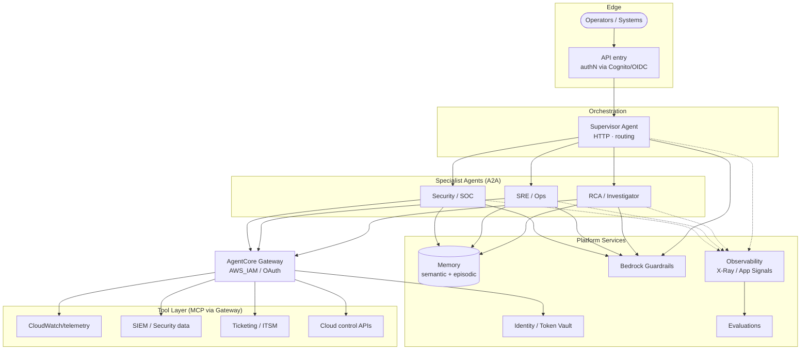

# Reference Architecture — SRE/RCA/SOC Agentic Platform

The target architecture every PRODUCTION use case builds on. This is the "should be",
informed by the POC and AgentCore best practices.

## Logical view

## Design tenets

- **Supervisor + A2A specialists + MCP tools** — the proven decomposition (kept from POC).
- **Per-agent isolation** — role, workload identity, and memory per runtime.
- **Guardrails and Identity are cross-cutting** — every agent inherits them.
- **Observability + Evaluations form a closed quality loop** feeding episodic memory.

## Scalability

- Stateless agent runtimes (AgentCore-managed scaling); state in Memory + external stores.
- Gateway aggregates tools so specialists don't hardcode integrations.
- Namespaced memory for multi-tenant growth.
- New use cases = new specialist(s) + tool targets, not a rebuild.

## To be detailed here

- [ ] Network topology (VPC mode for private telemetry; HA NAT)
- [ ] Data flow + retention/classification per data type
- [ ] Multi-account/landing-zone placement
- [ ] Failure modes & fallback (per the POC error-flow, hardened)
