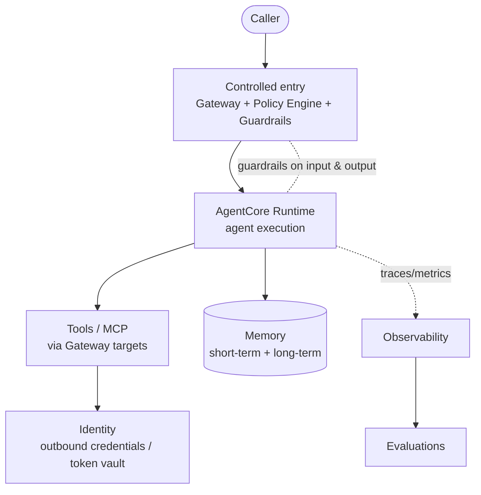

# Reference Architecture — Generic AgentCore Composition

How the AgentCore components compose into an agentic platform. This is a **generic,
use-case-agnostic** target — the structural blueprint that component standards plug into.

## Logical composition

## Component roles

| Component | Role in the composition |
|---|---|
| **Guardrails / Policy** | Controlled entry; authorization + input/output filtering; bypass prevention |
| **Runtime** | Hosts and scales the agent(s); protocol endpoints |
| **Gateway** | Exposes external APIs/tools as MCP tools to agents |
| **Identity** | Inbound auth + outbound credentials from the token vault |
| **Memory** | In-session context (STM) + cross-session knowledge (LTM strategies) |
| **Observability** | Tracing, metrics, logs across the execution path |
| **Evaluations** | Automated quality assessment feeding back into design |

## Composition tenets (generic)
- **Controlled single entry** — all traffic passes guardrails/authorization before reaching a runtime.
- **Per-agent isolation** — each runtime has its own role, identity, and memory.
- **Cross-cutting services** — Guardrails, Identity, and Observability apply to every agent.
- **Closed quality loop** — Observability feeds Evaluations, which informs design changes.
- **Stateless compute, durable state** — runtimes scale; state lives in Memory and external stores.

## Scalability & composition patterns
- Add capability by adding components/agents, not by rebuilding: a new tool = a gateway
  target; a new agent = a runtime + identity + memory; a new control = a policy.
- Namespaced memory and scoped policies allow growth across many boundaries/entities.

> This architecture is component-neutral. Each component's own standard (in its folder)
> details how it should be built and how it satisfies the 6 pillars.
