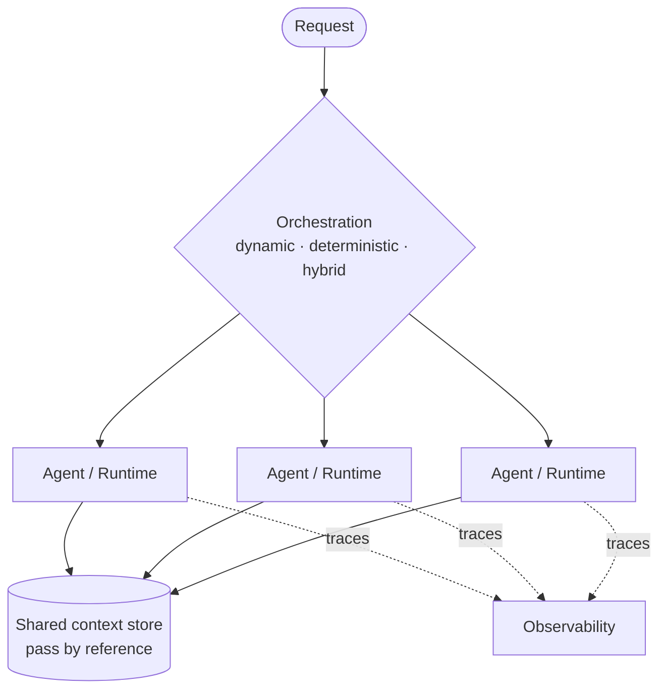
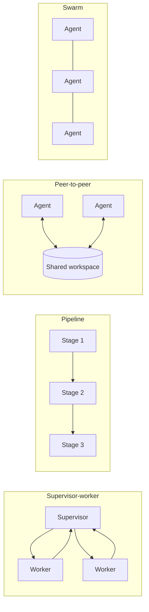

# Runtime & Multi-Agent Patterns — AgentCore Component Standard

> **Component:** Runtime (hosting, scaling, and orchestrating agents)
> **Scope:** independent, use-case-agnostic best-practice reference for running single and
> multi-agent systems on Amazon Bedrock AgentCore Runtime.
> **Structure:** the component is described once, then evaluated through the **6
> Well-Architected pillars**.
> **Sources:** AWS Well-Architected Agentic AI Lens + multi-agent guidance, cited inline
> and in `reference/SOURCES.md`. Verify against current documentation before implementing.

AgentCore Runtime hosts agents and tool servers as managed, scalable services and provides
the execution environment for multi-agent collaboration. The hardest part of a multi-agent
system is not any single agent — it is **orchestration**: how work is distributed, how
agents are selected and invoked, how intermediate results are passed, and how parallelism
reduces latency. [1]

---

## 1. Component overview

### First decision: sub-agent or tool? [2]
Before choosing any multi-agent pattern, decide whether a capability should be a **tool** a
single agent invokes, or a **sub-agent** it delegates to. A tool call completes in
milliseconds; a sub-agent delegation is a full LLM reasoning loop that costs time and
tokens.

| Use a **tool** when… | Use a **sub-agent** when… |
|---|---|
| Deterministic, stateless, single-step, fast (< 2–3s) | Needs its own reasoning (LLM inference for ambiguous inputs / judgment) |
| API call, DB lookup, format conversion | Needs its own context/memory scope |
| | Multi-step tool orchestration requiring reasoning |
| | A different model or prompt |
| | Independent failure isolation |

> Borderline? **Start with a tool**, promote to a sub-agent only when frequent
> re-invocation shows it needs its own reasoning loop. [2]

### Orchestration types [1]
- **Dynamic graphs** — reasoning-driven flows (framework-native orchestration).
- **Deterministic skeletons** — durable, rule-based flows (e.g. AWS Step Functions).
- **Hybrid** — a deterministic skeleton with dynamic reasoning layers where needed.

---

## 2. Multi-agent collaboration patterns [1][2]

Match the pattern to the **task shape**; no single pattern fits everything.

| Pattern | When to use | Key implementation notes |
|---|---|---|
| **Supervisor-worker** | Clear task decomposition + centralized quality control | Supervisor delegates and aggregates; watch for supervisor becoming a bottleneck |
| **Pipeline** | Natural sequential flow | Balance stage durations; chain agents via graph orchestration; use streaming/micro-batching to overlap stages |
| **Peer-to-peer / blackboard** | Multiple agents contribute partial solutions asynchronously | Shared workspace (shared context store) + event-driven notifications |
| **Swarm** | Parallel exploration / emergent behavior | **Must** define convergence criteria + per-swarm token/resource budgets |

### Delegation & handoff [1]
- Transfer **only the context the receiving agent needs** — not the full conversation
  history on every handoff.
- Use **shared context stores** (e.g. AgentCore Memory) and **standardized interfaces**
  (e.g. a gateway) instead of inline payloads.
- Treat **handoff latency as a first-class metric**.
- Pass large intermediate results **by reference** (e.g. object store / DynamoDB), not inline.

### Guardrails for dynamic graphs [1]
Run dynamic orchestrations with **cycle detection**, **maximum depth limits**, and
**bounded fan-out** to prevent unbounded delegation chains or runaway concurrency.

---

## 3. Runtime through the 6 Well-Architected pillars

### 🔒 Security
- Deploy agents on managed AgentCore Runtime (or container platforms) with **per-agent
  isolation** — own identity/role and failure boundary. [2]
- Delegate through **standardized interfaces** (gateway) rather than ad-hoc calls; scope
  what each agent can invoke. [1]

### 🛡️ Reliability
- **Timeouts and fallback mechanisms for every collaboration model** so one slow/failed
  agent can't block the whole workflow. [2]
- Per-step / per-branch / workflow-level timeouts derived from the task SLO; slow branches
  terminate with the **best partial result**. [1]
- Cycle detection, depth limits, bounded fan-out for dynamic graphs. [1]
- Use deterministic orchestration (Step Functions) for durable long-running flows. [2]

### ⚙️ Operational Excellence
- Classify each workflow as **dynamic / deterministic / hybrid** and place it on the right
  orchestrator. [1]
- **End-to-end distributed tracing** (AgentCore Observability / X-Ray) makes the critical
  path attributable; monitor coordination latency, redundant-work rate, throughput. [1][2]
- Start new workflows from **reusable patterns**; contribute reference implementations. [1]

### 🚀 Performance Efficiency
- **Default to tools**, not sub-agents, for deterministic single-step work — avoid paying a
  reasoning loop for millisecond work. [2]
- Run independent subtasks **in parallel**; keep end-to-end latency near the **critical
  path**, not the sum of steps. [1]
- Multi-stage pipelines: **streaming + micro-batching**, right-sized compute per stage. [1]
- Pass large results **by reference**; keep the orchestrator's context small. [1]
- Pre-warm predictable receivers (provisioned concurrency / warm session pools). [1]

### 💰 Cost Optimization
- Every sub-agent delegation costs tokens + latency — use the **right abstraction level**
  (tool vs sub-agent) to minimize cost. [2]
- Right-size compute per pipeline stage (don't over-provision light stages). [1]
- Swarm/dynamic patterns need **budgets** (token/resource caps, convergence criteria) to
  avoid runaway cost. [2]

### 🌱 Sustainability
- Tools over sub-agents where possible, parallelism over serial waiting, and by-reference
  passing all reduce wasted compute and token consumption. [1][2]

---

## 4. Maturity model (summary) [1]

| Level | What it looks like |
|---|---|
| 1 Initial | Sequential agent calls in app code; full payloads passed; sub-agents for tool-level work; no timeouts/telemetry |
| 2 Emerging | Workflows classified; Step Functions for deterministic; basic parallelism; shared stores replace inline payloads |
| 3 Defined | Cycle detection + depth/fan-out limits; per-workflow collaboration model; shared context stores carry delegation context |
| 4 Proactive | SLO-derived timeouts; end-to-end tracing; standardized delegation interfaces; async delegation + pre-warming |
| 5 Optimized | Patterns/models/schemas continuously refined against metrics; reusable patterns + reference implementations |

---

## 5. Design checklist (component acceptance)
- [ ] Each capability evaluated: **tool vs sub-agent** (default to tool)
- [ ] Workflow classified (dynamic / deterministic / hybrid) and placed on the right orchestrator
- [ ] Collaboration pattern matched to task shape (supervisor-worker / pipeline / peer-to-peer / swarm)
- [ ] Timeouts + fallback for every collaboration model
- [ ] Dynamic graphs: cycle detection + depth limit + bounded fan-out
- [ ] Delegation transfers minimal context; large results passed by reference; handoff latency measured
- [ ] Per-agent isolation; standardized delegation interfaces
- [ ] End-to-end tracing; coordination-overhead metrics monitored

## 6. Artifacts
- `examples/pattern-selection-guide.md` — task shape → pattern.
- `examples/tool-vs-subagent-checklist.md` — the abstraction-level decision.
- `examples/delegation-handoff.md` — delegation/handoff best practices.
- `reference/SOURCES.md` — sources + key facts.

---

## Sources
1. [Well-Architected Agentic AI Lens — AGENTPERF05: Workflow orchestration and multi-agent collaboration](https://docs.aws.amazon.com/wellarchitected/latest/agentic-ai-lens/agentperf05.html)
2. [AGENTPERF05-BP02: Implement optimized multi-agent collaboration models](https://docs.aws.amazon.com/wellarchitected/latest/agentic-ai-lens/agentperf05-bp02.html)
3. [Multi-agent architectures (AWS AI agent learning series)](https://aws.amazon.com/marketplace/build-learn/ai-agent-learning-series/multi-agent-architectures)
4. [AWS Well-Architected Framework](https://docs.aws.amazon.com/wellarchitected/latest/framework/welcome.html)

_Independent AgentCore component standard. Content was rephrased from the cited AWS sources
for compliance. Verify orchestration primitives, limits, and APIs against current
documentation._
