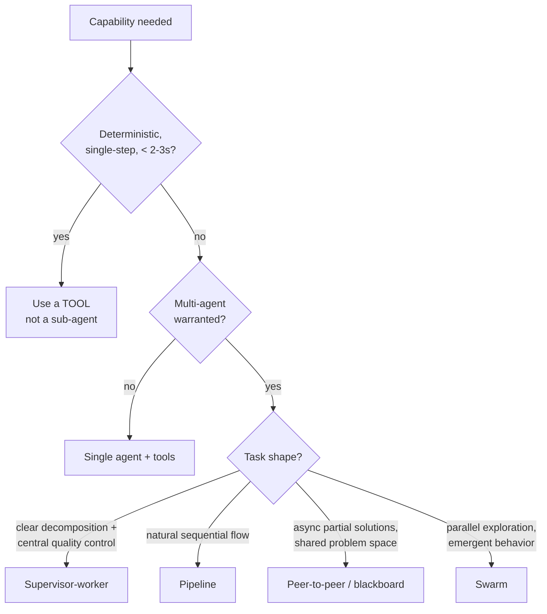

# Example — Multi-Agent Pattern Selection Guide

Match the collaboration pattern to the **task shape**. Grounded in the AWS Well-Architected
Agentic AI Lens (see `../reference/SOURCES.md`). Generic and use-case-agnostic.

## Decision flow

## Pattern → task characteristics

| Task characteristic | Pattern | Must-have controls |
|---|---|---|
| Clear decomposition; centralized aggregation/QA | **Supervisor-worker** | Avoid supervisor bottleneck; timeouts + fallback |
| Sequential stages, each transforms the last | **Pipeline** | Balance stage durations; streaming/micro-batch; right-size compute per stage |
| Multiple agents contribute asynchronously to one problem | **Peer-to-peer / blackboard** | Shared workspace + event-driven notifications |
| Benefits from parallel exploration / diversity | **Swarm** | Convergence criteria + per-swarm token/resource budget |
| Deterministic, durable, long-running | **Deterministic orchestration** (Step Functions) | Explicit state machine; retries |

## Classify the workflow first
- **Dynamic** (reasoning-driven) → framework-native graph orchestration.
- **Deterministic** (rule-based) → Step Functions or equivalent.
- **Hybrid** → deterministic skeleton + dynamic reasoning layers.

## Anti-patterns to avoid
- Sub-agent for what a tool-call could do in milliseconds.
- Supervisor-worker for *everything* (supervisor becomes a bottleneck).
- Swarm without convergence criteria or budgets (runs indefinitely).
- Sequential steps where the dependency graph allows parallelism.

_Source: AGENTPERF05 + BP02 [1][2] in `../reference/SOURCES.md`. Rephrased for compliance._
