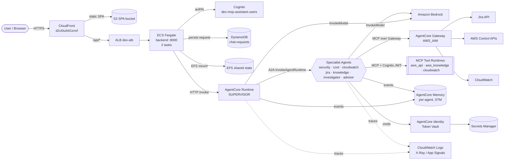
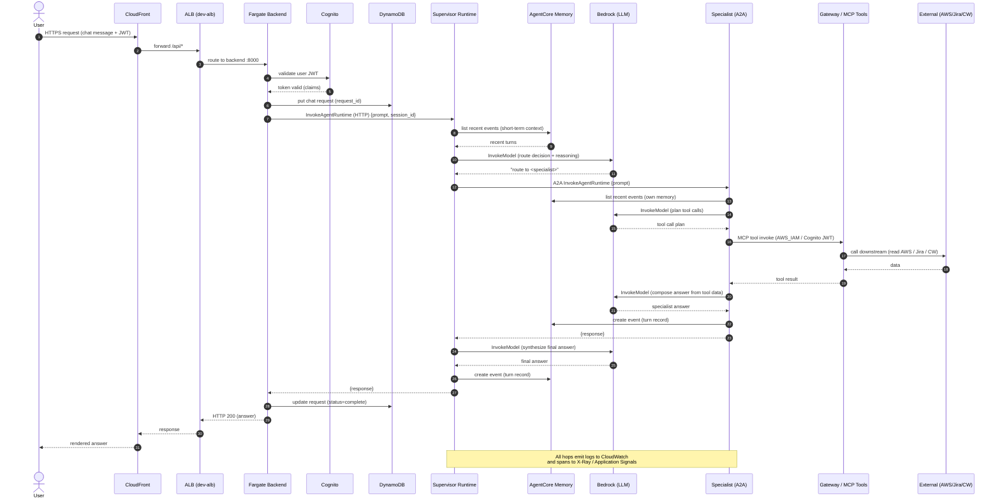
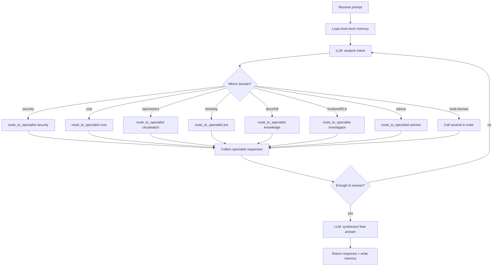
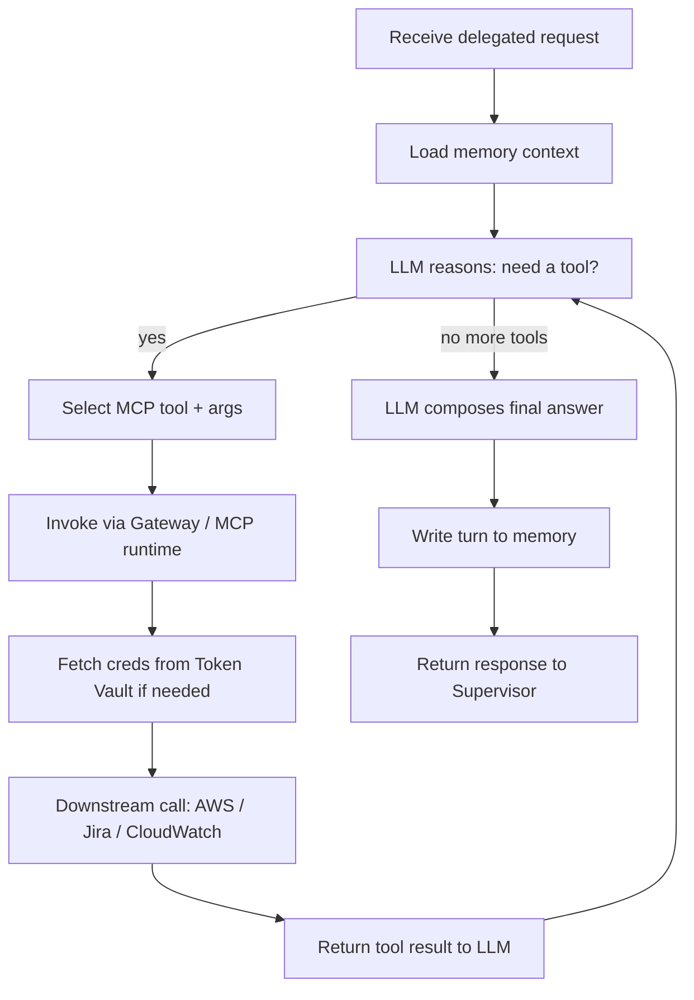
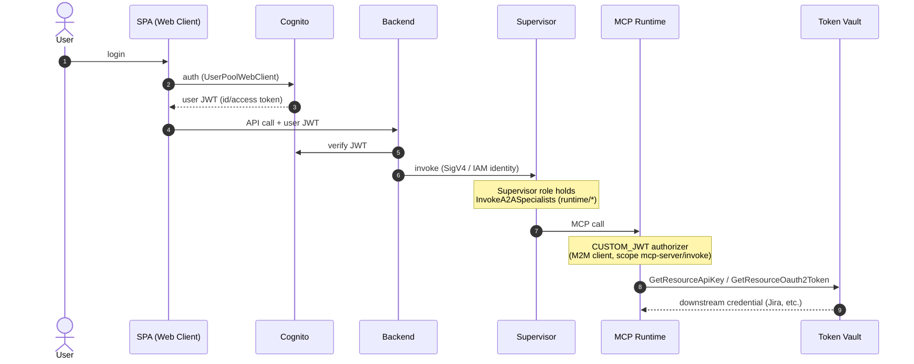
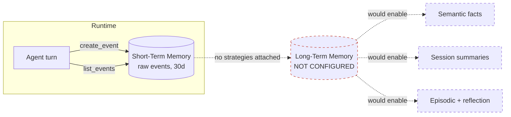
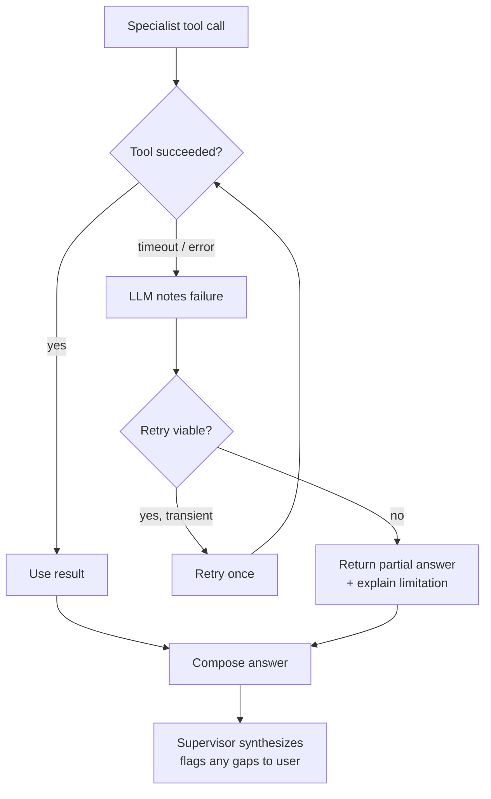

# Motadata MSP AI Assistant — End-to-End Request/Response Flow

> Based on live discovery of AWS account `001961766007`, region `us-east-1`.
> Diagrams are Mermaid — they render in GitHub, VS Code (with a Mermaid extension),
> and most Markdown viewers.

This document traces a user request from the browser all the way through the
supervisor → specialist → tool → Bedrock path and back, then drills into specific
use-case flows.

---

## 1. Component Overview (who talks to whom)



---

## 2. Full End-to-End Sequence (happy path)

This is the canonical flow for a single user question that requires one specialist.



---

## 3. Supervisor Routing Logic (LangGraph)

How the supervisor decides which specialist(s) to call. Mirrors
`agents/supervisor/graph.py`.



---

## 4. Specialist Agent Internal Loop (ReAct + MCP tools)

Every A2A specialist follows the same LangGraph ReAct loop
(`libs/common/graph.py` → `create_react_agent`).



---

## 5. Authentication & Authorization Flow

How identity flows across the layers (what is verified where).



---

## 6. Memory Write/Read Path (current: short-term only)

Reflects the deployed reality — per-agent memories are **STM only**
(`strategies: []`). Long-term (semantic/summary/episodic) is not yet wired to the
live runtimes.



---

## 7. Error / Fallback Handling



---

## 8. Notes on Fidelity

- Steps confirmed from control-plane discovery: runtime protocols (HTTP/A2A/MCP),
  supervisor `InvokeA2ASpecialists` IAM, Cognito JWT authorizer on MCP runtimes,
  gateway targets, per-agent STM memories, Bedrock model access, CloudWatch/X-Ray.
- Steps marked as backend behavior (DynamoDB write, Cognito verify, EFS use) are
  inferred from the resources + IAM and should be validated against the backend
  container code and the CDK stack.
- Exact per-agent Bedrock model IDs live in the deployment code, not the control
  plane; the diagrams show the generic `InvokeModel` interaction.
```
