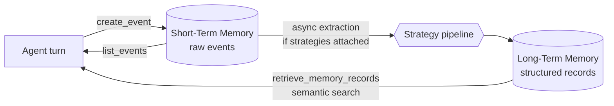
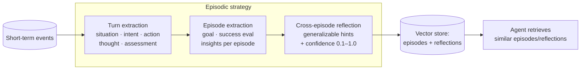
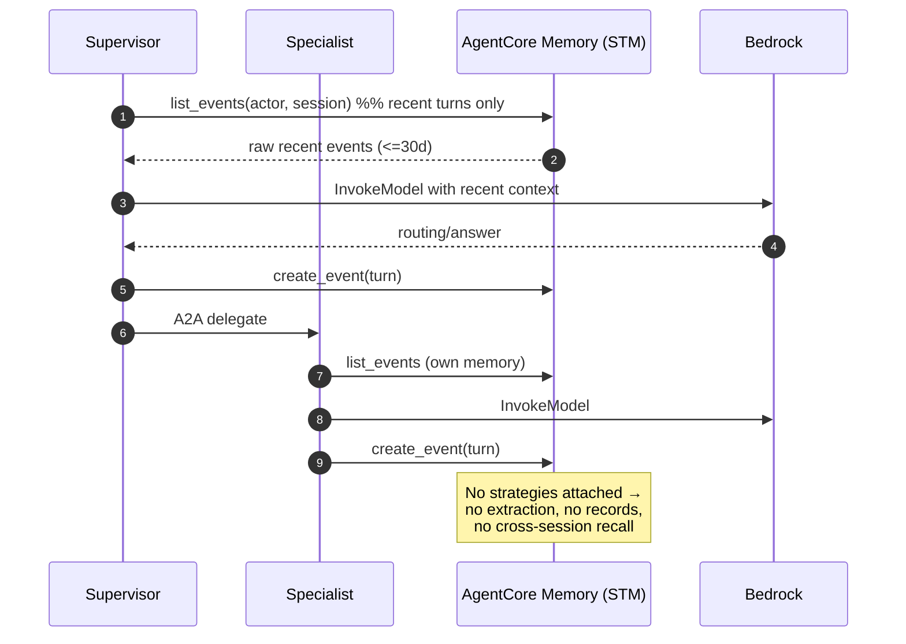
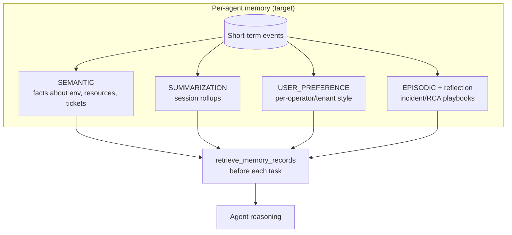

# Memory Architecture — Motadata MSP AI Assistant

> **Component:** Memory (first of the AI-platform component deep-dives)
> **Source of truth:** Live discovery of AWS account `001961766007`, region `us-east-1`
> (14 AgentCore Memory resources inspected via the control plane).
> **Reference standard:** Amazon Bedrock AgentCore Memory documentation + AWS Agentic AI
> best practices.

---

## 1. What "memory" means for this platform

An agent's usefulness over time depends on what it can remember. AgentCore Memory
provides two layers:

- **Short-term memory (STM)** — the raw, turn-by-turn conversational events within a
  session. Fast, literal, session-scoped. Expires after a configured window.
- **Long-term memory (LTM)** — *extracted* knowledge that persists across sessions.
  You don't store raw chat; instead **strategies** run extraction/consolidation in the
  background and write structured **memory records** you retrieve semantically.

Long-term memory is enabled **only** by attaching one or more **strategies** to a memory
resource. No strategy = no long-term memory, only STM.



---

## 2. The four built-in strategies (the full menu)

AgentCore ships four built-in long-term strategy types. This is the complete
end-to-end set your agents *could* use:

| Strategy | What it extracts | Answers the question | Best for |
|---|---|---|---|
| **SEMANTIC** | Facts / knowledge as vectors | "What do I know?" | Durable facts about entities, environment, tickets |
| **SUMMARIZATION** | Condensed session summaries | "What happened?" | Managing context length across long sessions |
| **USER_PREFERENCE** | User choices, styles, settings | "Who is this user?" | Personalization per operator/tenant |
| **EPISODIC** (+ reflection) | Structured episodes: goal → reasoning → actions → outcome, then cross-episode reflections | "How did I solve this before, and why did it work?" | Complex, repetitive workflows (RCA, incident triage) |

Each strategy writes to a **namespace** — a hierarchical path that isolates records by
actor/session/strategy, e.g. `users/{actorId}/facts` or
`travel_booking/users/{actorId}/episodes`.

### 2.1 How EPISODIC works (the deepest strategy)

Episodic memory is the one the AWS "learn from experience" guidance centers on. Its
pipeline has three stages:



- **Turn extraction** — segment each exchange into structured turn records (what was
  the situation, intent, action taken, reasoning, and did it succeed).
- **Episode extraction** — when a goal completes, synthesize related turns into a
  coherent episode with a success evaluation and insights.
- **Cross-episode reflection** — compare similar past episodes to distill *transferable*
  strategy ("when X, do Y; avoid Z"), each scored by how well it generalizes.

This is what lets an agent **avoid repeating mistakes** and reuse proven approaches.

---

## 3. Current implementation — exactly what is deployed

Your platform provisions **one memory resource per agent** (plus two older standalone
memories). Here is the verified state.

### 3.1 Live per-agent memories (used by the running runtimes)

Every runtime references its memory via env vars
`BEDROCK_AGENTCORE_MEMORY_ID` / `BEDROCK_AGENTCORE_MEMORY_NAME`. All of these are
**short-term only**:

| Memory (agent) | Expiry | Strategies | Long-term? |
|---|---|---|---|
| `dev_msp_supervisor_agent_mem` | 30d | `[]` | ❌ STM only |
| `dev_security_a2a_runtime_mem` | 30d | `[]` | ❌ STM only |
| `dev_cost_a2a_runtime_mem` | 30d | `[]` | ❌ STM only |
| `dev_cloudwatch_a2a_runtime_mem` | 30d | `[]` | ❌ STM only |
| `dev_jira_a2a_runtime_mem` | 30d | `[]` | ❌ STM only |
| `dev_knowledge_a2a_runtime_mem` | 30d | `[]` | ❌ STM only |
| `dev_investigator_a2a_runtime_mem` | 30d | `[]` | ❌ STM only |
| `dev_advisor_a2a_runtime_mem` | 30d | `[]` | ❌ STM only |
| `dev_aws_api_mcp_mem` | 30d | `[]` | ❌ STM only |
| `dev_aws_knowledge_mcp_mem` | 30d | `[]` | ❌ STM only |
| `dev_cloudwatch_mcp_mem` | 30d | `[]` | ❌ STM only |
| `msp_supervisor_agent_mem` (older) | 30d | `[]` | ❌ STM only |

Their descriptions literally read *"Memory for agent … with STM only."*

### 3.2 Standalone memories with long-term strategies (NOT wired to any runtime)

Two memories *do* carry long-term strategies — but no runtime env var references them,
so they sit off the live path:

| Memory | Expiry | Strategies present | Types |
|---|---|---|---|
| `dev_msp_assistant_memory` | 90d | `SemanticFacts`, `SessionSummaries` | SEMANTIC + SUMMARIZATION |
| `msp_assistant_memory` (older) | 90d | `SemanticFacts`, `SessionSummaries` | SEMANTIC + SUMMARIZATION |

Namespaces observed:
- SEMANTIC → `/strategy/{memoryStrategyId}/actor/{actorId}/`
- SUMMARIZATION → `/strategy/{memoryStrategyId}/actor/{actorId}/session/{sessionId}/`

### 3.3 Coverage vs. the full strategy menu

| Strategy type | In the account? | Attached to a live agent? |
|---|:---:|:---:|
| SEMANTIC | ✅ (2 unwired memories) | ❌ |
| SUMMARIZATION | ✅ (2 unwired memories) | ❌ |
| USER_PREFERENCE | ❌ | ❌ |
| **EPISODIC** (+ reflection) | ❌ | ❌ |

**Bottom line:** the live agents run **short-term memory only**. There is **no episodic
strategy anywhere**, and the semantic/summarization strategies you built are not
connected to any running agent.

---

## 4. End-to-end memory data flow (as currently implemented)



Because no strategies are attached, `retrieve_memory_records` on the live memories
returns nothing — agents cannot recall knowledge, summaries, preferences, or past
episodes across sessions. Context resets at session boundaries (and hard-expires at 30
days).

---

## 5. Target architecture (what "complete" looks like)

Recommended end-state, mapping each strategy to where it adds the most value here:



| Agent | Recommended strategies | Why |
|---|---|---|
| supervisor | SUMMARIZATION + SEMANTIC | Retain long-session context; remember environment facts |
| investigator | **EPISODIC** + SEMANTIC | RCA is the textbook episodic case — reuse past incident playbooks |
| cloudwatch | EPISODIC + SEMANTIC | Recurring alarm patterns → learn effective triage steps |
| security | SEMANTIC + EPISODIC | Remember prior findings + how they were remediated |
| cost | SEMANTIC + SUMMARIZATION | Track spend facts and recurring optimization moves |
| jira | SEMANTIC | Remember ticket/project conventions |
| knowledge | SEMANTIC | Cache durable KB facts |
| advisor | SEMANTIC + USER_PREFERENCE | Tailor advice to operator/tenant preferences |

### 5.1 How to attach a strategy (reference)

Add strategies at create time or via update. Example `agentcore.json` fragment:

```json
{
  "memories": [{
    "name": "dev_investigator_a2a_runtime_mem",
    "eventExpiryDuration": 90,
    "strategies": [
      { "type": "SEMANTIC", "name": "facts",
        "namespaces": ["agents/investigator/actor/{actorId}/facts"] },
      { "type": "EPISODIC", "name": "episodes",
        "namespaces": ["agents/investigator/actor/{actorId}/episodes/{sessionId}"],
        "reflectionNamespaces": ["agents/investigator/actor/{actorId}/reflections"] }
    ]
  }]
}
```

Or via the SDK/MCP `memory_update` with `addMemoryStrategies`. After attaching,
`create_event` calls trigger background extraction; monitor with
`list_extraction_jobs`.

> **Note:** the reflection namespace must be a sub-path of the episode namespace.

---

## 6. Gaps & missing pieces vs. AWS Agentic AI best practices

This is where the current build falls short of AWS's recommended agentic-memory design.
Ordered by impact.

| # | Severity | Gap | Best-practice expectation | Recommended fix |
|---|---|---|---|---|
| 1 | **High** | **No long-term memory on any live agent** (all `strategies: []`) | Agents should persist extracted knowledge across sessions | Attach SEMANTIC + SUMMARIZATION to the per-agent memories that are actually referenced by runtimes |
| 2 | **High** | **No EPISODIC strategy anywhere** | Complex/repetitive workflows should learn from past experiences (episodes + reflection) | Add EPISODIC to `investigator`, `cloudwatch`, `security` first — highest ROI |
| 3 | **High** | **Strategy/runtime mismatch** — the only memories with strategies (`dev_msp_assistant_memory`) are not referenced by any runtime env var | The memory an agent uses must be the one carrying its strategies | Point runtimes at strategy-enabled memories, or add strategies to the per-agent `*_mem` resources; retire the orphan memories |
| 4 | **Medium** | **No USER_PREFERENCE strategy** | Multi-tenant/MSP assistants should personalize per operator/tenant | Add USER_PREFERENCE where per-user tailoring matters (advisor, supervisor) |
| 5 | **Medium** | **No deliberate namespace design** | Namespaces should isolate by tenant/actor/session for MSP multi-tenancy | Define a namespace convention (e.g. `tenant/{tenantId}/agent/{name}/actor/{actorId}/…`) before enabling strategies |
| 6 | **Medium** | **Short STM expiry (30d) + no retrieval-before-act pattern** | Agents should retrieve relevant memories before responding | Implement a "retrieve → reason → write" loop in each agent (the repo's `MemoryClient.retrieve()` is scaffolded for this) |
| 7 | **Low/Med** | **No encryption with customer-managed KMS on memory** | Sensitive MSP/ITSM data may require CMK | Set `encryptionKeyArn` on memory resources handling sensitive content |
| 8 | **Low/Med** | **No extraction-job monitoring / redrive** | Failed extractions should be observed and retried | Add `list_extraction_jobs` checks + alarms; redrive failures |
| 9 | **Low** | **Inconsistent expiry (30d vs 90d) and duplicate/legacy memories** | Consistent retention policy; decommission superseded resources | Standardize expiry per data class; delete `msp_*` legacy + orphan memories |
| 10 | **Low** | **No memory content sanitization noted** | Retrieved memory is untrusted input; sanitize before use in prompts | Treat `retrieve_memory_records` output as untrusted; apply the same input filtering as user content |

### Quick-win sequence
1. Attach **SEMANTIC + SUMMARIZATION** to the live per-agent memories (fixes gaps 1 & 3).
2. Add **EPISODIC + reflection** to `investigator` and `cloudwatch` (fixes gap 2, biggest capability jump).
3. Define the **namespace + tenant** convention (gap 5) *before* scaling strategies.
4. Wire the **retrieve-before-act** loop in agent code (gap 6).
5. Clean up **orphan/legacy** memories and standardize retention (gaps 3, 9).

---

## 7. Summary

- **Today:** short-term memory only on every live agent; two orphaned memories carry
  SEMANTIC + SUMMARIZATION but are unused; **zero episodic memory**.
- **Effect:** agents cannot learn across sessions, cannot personalize, and cannot reuse
  past incident/RCA experience — the core value of agentic memory is not yet realized.
- **Path forward:** attach the right built-in strategies per agent (Section 5), lead with
  EPISODIC for the investigator/ops agents, and design namespaces for MSP multi-tenancy
  before scaling. The repo's `libs/common/memory.py` already exposes the STM + LTM APIs
  so enabling this is largely configuration + a retrieve-before-act loop, not a rewrite.

_All state in Sections 3–4 is verified against the live account. Section 2/5 strategy
descriptions follow the AgentCore Memory documentation._
