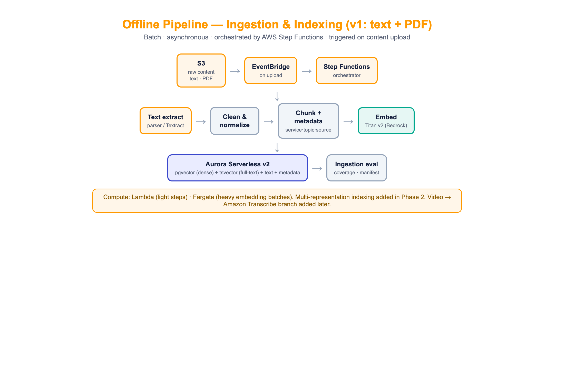
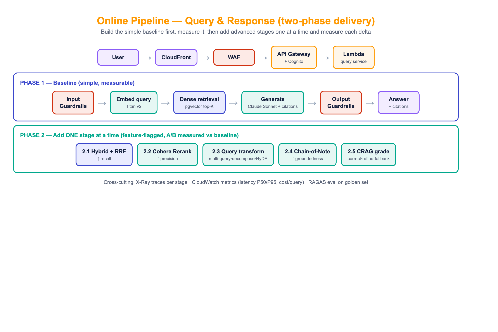
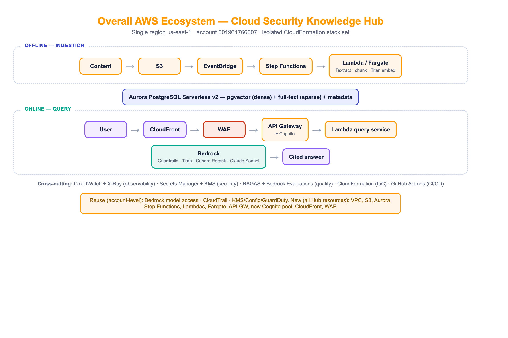

# Cloud Security Knowledge Hub

A customer-facing production RAG system that answers cloud-security questions (AWS first):
how to configure a service securely, how an attack happens on AWS, and how to prevent it.

Built as a PRODUCTION use case on the `AI-PLATFORM/` standards (rag, guardrails, memory,
runtime). Custom advanced-RAG on AWS, single region `us-east-1`, ~20 users, ~$300/mo.

## Documents
- **`PLAN.md`** — the master plan: decisions, offline + online pipelines, AWS services
  (what/how/why), reuse-vs-new, CloudFormation structure, Lambda pros/cons.
- **`AI-SDLC-AND-EVALS.md`** — per-component tests + evals, golden dataset approach, CI/CD,
  phased milestones, the two-phase measurement strategy.
- **`COST-AND-REUSE.md`** — cost model (~$300/mo, service-by-service) + reuse analysis.
- **`diagrams/`** — architecture diagrams.

## Architecture at a glance

**Offline (ingestion — v1: text + PDF):**

**Online (query — two-phase delivery):**

**Overall ecosystem:**

## Key idea: learn by measuring
The online pipeline ships as a **simple baseline first** (Phase 1), which you measure, then
adds advanced stages **one at a time** (Phase 2) — hybrid+RRF, Cohere Rerank, query
transformation, Chain-of-Note, CRAG — each A/B-measured against the golden set so you learn
the real need, significance, and impact of every technique before keeping it.

## Build folders (created as phases start)
- `infra/` — CloudFormation (raw YAML, nested stacks)
- `ingestion/` — offline pipeline code
- `query-service/` — online pipeline code (baseline first)
- `evals/` — eval harness + golden dataset (built later, together)

## Status
Planning complete. Next: **P0 foundation** (VPC, Aurora+pgvector, S3, CFN skeleton, CI/CD OIDC).
See `AI-SDLC-AND-EVALS.md §7` for milestones.
